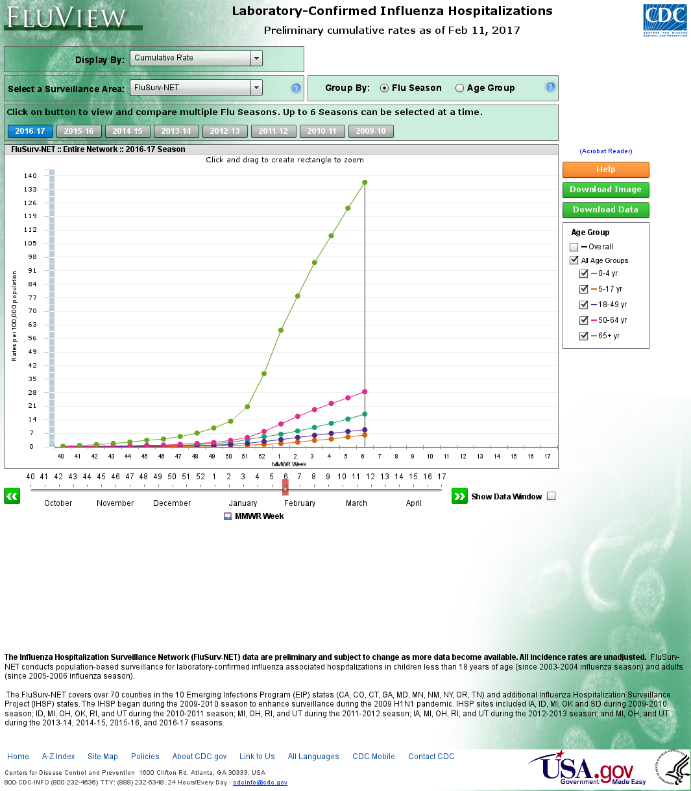

[](https://travis-ci.org/hrbrmstr/splashr)

`splashr` : Tools to Work with the 'Splash' JavaScript Rendering Service

TL;DR: This package works with Splash rendering servers which are really just a REST API & `lua` scripting interface to a QT browser. It's an alternative to the Selenium ecosystem which was really engineered for application testing & validation.

Sometimes, all you need is a page scrape after javascript has been allowed to roam wild and free over your meticulously crafted HTML tags. So, this package does not do *everything* Selenium can, but if you're just trying to get a page back that needs javascript rendering, this is a nice alternative.

It's also an alternative to `phantomjs` (which you can use in R within or without a Selenium context as it's it's own webdriver) and it may be useful to compare renderings between this package & `phantomjs`.

You can also get it running with two commands:

    sudo docker pull hrbrmstr/splashttpd
    sudo docker run -p 5023:5023 -p 8050:8050 -p 8051:8051 hrbrmstr/splashttpd

Do whatever you Windows ppl do with Docker on your systems to make ^^ work.

Folks super-new to Docker on Unix-ish platforms should [make sure to do](https://github.com/hrbrmstr/splashr/issues/3#issuecomment-280686494):

    sudo groupadd docker
    sudo usermod -aG docker $USER

(`$USER` is your username and shld be defined for you in the environment)

If using the [`harbor`](https://github.com/wch/harbor) package you can use the convience wrappers in this pacakge:

    install_splash()
    splash_container <- start_splash()

and then run:

    stop_splash(splash_container)

when done. All of that happens on your localhost and you will not need to specify `splash_obj` to many of the `splashr` functions if you're running Splash in this default configuration as long as you use named parameters. You can also use the pre-defined `splash_local` object if you want to use positional parameters.

You can run Selenium in Docker, so this is not unique to Splash. But, a Docker context makes it so that you don't have to run or maintain icky Python stuff directly on your system. Leave it in the abandoned warehouse district where it belongs.

All you need for this package to work is a running Splash instance. You provide the host/port for it and it's scrape-tastic fun from there!

### About Splash

> 'Splash' <https://github.com/scrapinghub/splash> is a javascript rendering service. It’s a lightweight web browser with an 'HTTP' API, implemented in Python using 'Twisted'and 'QT' \[and provides some of the core functionality of the 'RSelenium' or 'seleniumPipes' R packages but with a Java-free footprint\]. The (twisted) 'QT' reactor is used to make the sever fully asynchronous allowing to take advantage of 'webkit' concurrency via QT main loop. Some of Splash features include the ability to process multiple webpages in parallel; retrieving HTML results and/or take screenshots; disabling images or use Adblock Plus rules to make rendering faster; executing custom JavaScript in page context; getting detailed rendering info in HAR format.

The following functions are implemented:

-   `render_html`: Return the HTML of the javascript-rendered page.
-   `render_file`: Return the HTML or image (png) of the javascript-rendered page in a local file
-   `render_har`: Return information about Splash interaction with a website in [HAR](http://www.softwareishard.com/blog/har-12-spec/) format.
-   `render_jpeg`: Return a image (in JPEG format) of the javascript-rendered page.
-   `render_png`: Return a image (in PNG format) of the javascript-rendered page.
-   `execute_lua`: Execute a custom rendering script and return a result.
-   `splash`: Configure parameters for connecting to a Splash server
-   `install_splash`: Retrieve the Docker image for Splash
-   `start_splash`: Start a Splash server Docker container
-   `stop_splash`: Stop a running a Splash server Docker container

Mini-DSL (domain-specific language). These can be used to create a "script" without actually scripting in Lua. They are a less-powerful/configurable set of calls than what you can make with a full Lua function but the idea is to have it take care of very common but simple use-cases, like waiting a period of time before capturing a HAR/HTML/PNG image of a site:

-   `splash_plugins`: Enable or disable browser plugins (e.g. Flash).
-   `splash_click`: Trigger mouse click event in web page.
-   `splash_focus`: Focus on a document element provided by a CSS selector
-   `splash_images`: Enable/disable images
-   `splash_response_body`: Enable or disable response content tracking.
-   `splash_go`: Go to an URL.
-   `splash_wait`: Wait for a period time
-   `splash_har`: Return information about Splash interaction with a website in HAR format.
-   `splash_html`: Return a HTML snapshot of a current page.
-   `splash_png`: Return a screenshot of a current page in PNG format.
-   `splash_press`: Trigger mouse press event in web page.
-   `splash_release`: Trigger mouse release event in web page.
-   `splash_send_keys`: Send keyboard events to page context.
-   `splash_send_text`: Send text as input to page context, literally, character by character.
-   `splash_user_agent`: Overwrite the User-Agent header for all further requests. NOTE: There are many "helper" user agent strings to go with `splash_user_agent`. Look for objects in `splashr` starting with `ua_`.

`httr` helpers. These help turn various bits of `splashr` objects into `httr`-ish things:

-   `as_req`: Turn a HAR response entry into a working `httr` function you can use to make a request with
-   `as_request`: Turn a HAR response entry into an `httr` `response`-like object (i.e. you can use `httr::content()` on it)

Helpers:

-   `get_body_size`: Retrieve size of content | body | headers
-   `get_content_sie`: Retrieve size of content | body | headers
-   `get_content_type` Retrieve or test content type of a HAR request object
-   `get_headers_size` Retrieve size of content | body | headers
-   `is_binary`: Retrieve or test content type of a HAR request object
-   `is_content_type`: Retrieve or test content type of a HAR request object
-   `is_css`: Retrieve or test content type of a HAR request object
-   `is_gif`: Retrieve or test content type of a HAR request object
-   `is_html`: Retrieve or test content type of a HAR request object
-   `is_javascript`: Retrieve or test content type of a HAR request object
-   `is_jpeg`: Retrieve or test content type of a HAR request object
-   `is_json`: Retrieve or test content type of a HAR request object
-   `is_plain`: Retrieve or test content type of a HAR request object
-   `is_png`: Retrieve or test content type of a HAR request object
-   `is_svg`: Retrieve or test content type of a HAR request object
-   `is_xhr`: Retrieve or test content type of a HAR request object
-   `is_xml`: Retrieve or test content type of a HAR request object

Some functions from `HARtools` are imported/exported and `%>%` is imported/exported.

### TODO

Suggest more in a feature req!

-   <strike>Implement `render.json`</strike>
-   <strike>Implement "file rendering"</strike>
-   <strike>Implement `execute` (you can script Splash!)</strike>
-   <strike>Add integration with [`HARtools`](https://github.com/johndharrison/HARtools)</strike>
-   <strike>*Possibly* writing R function wrappers to install/start/stop Splash</strike> which would also support enabling javascript profiles, request filters and proxy profiles from with R directly, using [`harbor`](https://github.com/wch/harbor)
-   Testing results with all combinations of parameters

### Installation

``` r
devtools::install_github("hrbrmstr/splashr")
```

``` r
options(width=120)
```

### Usage

NOTE: ALL of these examples assume Splash is running in the default configuraiton on `localhost` (i.e. started with `start_splash()` or the docker example commands) unless otherwise noted.

``` r
library(splashr)
library(magick)
library(rvest)
library(anytime)
library(hrbrmisc) # github
library(htmlwidgets)
library(DiagrammeR)
library(tidyverse)

# current verison
packageVersion("splashr")
```

    ## [1] '0.3.0'

``` r
splash_active()
```

    ## [1] TRUE

``` r
splash_debug()
```

    ## List of 7
    ##  $ active  : list()
    ##  $ argcache: int 0
    ##  $ fds     : int 20
    ##  $ leaks   :List of 4
    ##   ..$ Deferred  : int 50
    ##   ..$ LuaRuntime: int 1
    ##   ..$ QTimer    : int 1
    ##   ..$ Request   : int 1
    ##  $ maxrss  : int 185612
    ##  $ qsize   : int 0
    ##  $ url     : chr "http://localhost:8050"
    ##  - attr(*, "class")= chr [1:2] "splash_debug" "list"
    ## NULL

Notice the difference between a rendered HTML scrape and a non-rendered one:

``` r
render_html(url = "http://marvel.com/universe/Captain_America_(Steve_Rogers)")
```

    ## {xml_document}
    ## <html xmlns="http://www.w3.org/1999/xhtml" xml:lang="en" lang="en" dir="ltr">
    ## [1] <head>\n<script type="text/javascript" async="async" src="http://dpm.demdex.net/id?d_rtbd=json&amp;d_ver=2&amp;d_ ...
    ## [2] <body id="index-index" class="index-index" onload="findLinks('myLink');">\n\n\t<div id="page_frame" style="overfl ...

``` r
xml2::read_html("http://marvel.com/universe/Captain_America_(Steve_Rogers)")
```

    ## {xml_document}
    ## <html xmlns="http://www.w3.org/1999/xhtml" xml:lang="en" lang="en" dir="ltr">
    ## [1] <head>\n<meta http-equiv="X-UA-Compatible" content="IE=Edge">\n<link href="https://plus.google.com/10852333737344 ...
    ## [2] <body id="index-index" class="index-index" onload="findLinks('myLink');">\n\n\t<div id="page_frame" style="overfl ...

You can also profile pages:

``` r
render_har(url = "http://www.poynter.org/") -> har

print(har)
```

    ## --------HAR VERSION-------- 
    ## HAR specification version: 1.2 
    ## --------HAR CREATOR-------- 
    ## Created by: Splash 
    ## version: 2.3.1 
    ## --------HAR BROWSER-------- 
    ## Browser: QWebKit 
    ## version: 538.1 
    ## --------HAR PAGES-------- 
    ## Page id: 1 , Page title: Poynter – A global leader in journalism. Strengthening democracy. 
    ## --------HAR ENTRIES-------- 
    ## Number of entries: 25 
    ## REQUESTS: 
    ## Page: 1 
    ## Number of entries: 25 
    ##   -  http://www.poynter.org/ 
    ##   -  http://maxcdn.bootstrapcdn.com/bootstrap/3.3.5/css/bootstrap.min.css?ver=2016_06_24.1 
    ##   -  http://www.poynter.org/wp-content/themes/poynter_timber/assets/scrollbar/jquery.mCustomScrollbar.min.css?ver=2016... 
    ##   -  http://www.poynter.org/wp-content/plugins/jetpack/css/jetpack.css?ver=4.0.4 
    ##   -  http://www.poynter.org/wp-content/themes/poynter_timber/style.css?ver=2016_06_24.1 
    ##      ........ 
    ##   -  http://cloud.webtype.com/webtype/ff2/3/7dac2f83-affe-4762-81f1-056f47b74dc7?ec_token=8f7c4c4997246fd7fa920171c994... 
    ##   -  http://cloud.webtype.com/webtype/ff2/3/c6369fc5-fc59-4a12-ac92-25afa6c567a0?ec_token=8f7c4c4997246fd7fa920171c994... 
    ##   -  http://cloud.webtype.com/webtype/ff2/3/380e3672-840d-462a-83ee-2ea85a43504a?ec_token=8f7c4c4997246fd7fa920171c994... 
    ##   -  http://cloud.webtype.com/webtype/ff2/3/4ac7f809-9bdf-4acc-8bd5-a922f05f271b?ec_token=8f7c4c4997246fd7fa920171c994... 
    ##   -  http://cloud.webtype.com/webtype/ff2/3/c6608520-1978-45ac-9061-74ada664cae4?ec_token=8f7c4c4997246fd7fa920171c994...

You can use [`HARtools::HARviewer`](https://github.com/johndharrison/HARtools/blob/master/R/HARviewer.R) — which this pkg import/exports — to get view the HAR in an interactive HTML widget.

Full web page snapshots are easy-peasy too:

``` r
render_png(url = "http://www.marveldirectory.com/individuals/c/captainamerica.htm")
```


``` r
render_jpeg(url = "http://static2.comicvine.com/uploads/scale_small/3/31666/5052983-capasr2016001-eptingvar-18bdb.jpg") 
```


### Executing custom Lua scripts

``` r
lua_ex <- '
function main(splash)
  splash:go("http://rud.is/b")
  splash:wait(0.5)
  local title = splash:evaljs("document.title")
  return {title=title}
end
'

splash_local %>% execute_lua(lua_ex) -> res

rawToChar(res) %>% 
  jsonlite::fromJSON()
```

    ## $title
    ## [1] "rud.is | \"In God we trust. All others must bring data\""

### Interacting With Flash sites

``` r
splash_local %>% 
  splash_plugins(TRUE) %>%
  splash_go("https://gis.cdc.gov/GRASP/Fluview/FluHospRates.html") %>%
  splash_wait(4) %>%
  splash_click(460, 550) %>%
  splash_wait(2) %>%
  splash_png()
```



### Rendering Widgets

``` r
splash_vm <- start_splash(add_tempdir = TRUE)
```

``` r
DiagrammeR("
  graph LR
    A-->B
    A-->C
    C-->E
    B-->D
    C-->D
    D-->F
    E-->F
") %>% 
  saveWidget("/tmp/diag.html")

render_file(url = "/tmp/diag.html", output="html")
```


``` r
stop_splash(splash_vm)
```

### Test Results

``` r
library(splashr)
library(testthat)

date()
```

    ## [1] "Thu Feb 23 17:25:10 2017"

``` r
test_dir("tests/")
```

    ## testthat results ========================================================================================================
    ## OK: 8 SKIPPED: 0 FAILED: 0
    ## 
    ## DONE ===================================================================================================================

### Code of Conduct

Please note that this project is released with a [Contributor Code of Conduct](CONDUCT.md). By participating in this project you agree to abide by its terms.
