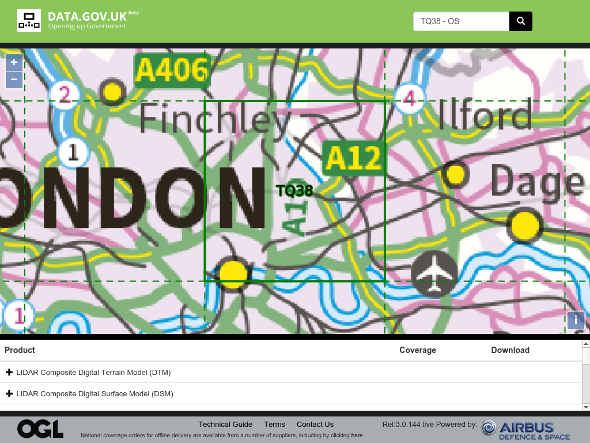

Splash has a ton of features and `splashr` exposes many of them. The `render_` functions and DSL can return everything from simple, tiny JSON data to huge, nested `list` structures of complex objects.

Furthermore, web content mining can be tricky. Modern sites can present information in different ways depending on the type of browser or device you use and many won't serve pages to "generic" browsers.

Finally, the Dockerized containers of Splash servers make it really easy to get started, but you may prefer an R console over the system command-line.

Let's see what extra goodies `splashr` provides to make our lives easier.

## Handling `splashr` Objects

One of the most powerful functions in `splashr` is `render_har()`. You get every component loaded by dynamic web page, and some sites have upwards of 100 elements for any given page. How can you get to the bits that you want?

Let's use a different example that's a bit gnarly (i.e. you may need to work through it a couple times).

The U.K. government has an open data portal and one of the sections contains map tiles for various grid quadrants. It's a really nice site, but it's designed for interactive use and we want to be able to get to all the tile files programmatically. For our example, we'll be grabbing data from <http://environment.data.gov.uk/ds/survey/index.jsp#/survey?grid=TQ38>.



Since we don't know what we need, let's use `render_har()` to get everything back into R:

```
library(splashr)
library(httr)
library(tidyverse)

pg_har <- render_har(url = "http://environment.data.gov.uk/ds/survey/index.jsp#/survey?grid=TQ38", response_body = TRUE, wait = 10)

entries <- har_entries(pg_har)

map_chr(entries, get_content_type) %>%
  table()
## .
## application/json        image/gif        image/png         text/css        text/html
##               33                1               24                1                1
##  text/javascript
##                1

map_chr(entries, get_request_url)
##  [1] "http://environment.data.gov.uk/ds/survey/index.jsp#/survey?grid=TQ38"
##  [2] "http://www.geostore.com/environment-agency/survey.full.min.170718.css"
##  [3] "http://www.geostore.com/environment-agency/survey.full.min.170718.js"
##  [4] "http://environment.data.gov.uk/ds/survey/images/busy.gif"
##  [5] "http://environment.data.gov.uk/ds/survey/rest/config/download?_=1503933543160"
##  [6] "http://www.geostore.com/environment-agency/rest/grid/EA_SUPPLIED_OS_10KM/TQ38"
##  [7] "http://www.geostore.com/environment-agency/rest/gazetteer/search/postcode/TQ38"
##  [8] "http://environment.data.gov.uk/ds/survey/images/download.png"
##  [9] "http://www.geostore.com/environment-agency/images/dgu-header-white.png"
## [10] "http://www.geostore.com/environment-agency/images/airbus-footer-logo.png"
## [11] "http://www.geostore.com/environment-agency/images/ogl-symbol-41px-retina-black.png"
## [12] "http://environment.data.gov.uk/ds/survey/fonts/glyphicons-halflings-regular.woff2"
## [13] "http://www.geostore.com/environment-agency/WMSExpeditedAdapter?SESSIONID=UEADOWNLOAD&CID=CDEFAULTEAGEOSTORE&UID=UEADOWNLOAD&PASSWORD=A1r5us2015DLD&INTERFACE=EAPUBLICDOWNLOAD&MAP=%2Fvar%2Fmapserver%2Fmapfiles%2FEAPUBLIC.map&SERVICE=WMS&VERSION=1.3.0&REQUEST=GetMap&FORMAT=image%2Fpng&TRANSPARENT=true&LAYERS=EA-DLD-OSRASTERS&TILED=false&SRS=EPSG%3A27700&WIDTH=256&HEIGHT=256&CRS=EPSG%3A27700&STYLES=&BBOX=390919.47990708053%2C234551.68794424832%2C469103.375888497%2C312735.5839256648"
## [14] "http://www.geostore.com/environment-agency/WMSExpeditedAdapter?SESSIONID=UEADOWNLOAD&CID=CDEFAULTEAGEOSTORE&UID=UEADOWNLOAD&PASSWORD=A1r5us2015DLD&INTERFACE=EAPUBLICDOWNLOAD&MAP=%2Fvar%2Fmapserver%2Fmapfiles%2FEAPUBLIC.map&SERVICE=WMS&VERSION=1.3.0&REQUEST=GetMap&FORMAT=image%2Fpng&TRANSPARENT=true&LAYERS=EA-DLD-OSRASTERS&TILED=false&SRS=EPSG%3A27700&WIDTH=256&HEIGHT=256&CRS=EPSG%3A27700&STYLES=&BBOX=469103.37588850036%2C234551.68794424832%2C547287.2718699168%2C312735.5839256648"
## [15] "http://www.geostore.com/environment-agency/WMSExpeditedAdapter?SESSIONID=UEADOWNLOAD&CID=CDEFAULTEAGEOSTORE&UID=UEADOWNLOAD&PASSWORD=A1r5us2015DLD&INTERFACE=EAPUBLICDOWNLOAD&MAP=%2Fvar%2Fmapserver%2Fmapfiles%2FEAPUBLIC.map&SERVICE=WMS&VERSION=1.3.0&REQUEST=GetMap&FORMAT=image%2Fpng&TRANSPARENT=true&LAYERS=EA-DLD-OSRASTERS&TILED=false&SRS=EPSG%3A27700&WIDTH=256&HEIGHT=256&CRS=EPSG%3A27700&STYLES=&BBOX=390919.47990708053%2C312735.5839256644%2C469103.375888497%2C390919.4799070809"
## [16] "http://www.geostore.com/environment-agency/WMSExpeditedAdapter?SESSIONID=UEADOWNLOAD&CID=CDEFAULTEAGEOSTORE&UID=UEADOWNLOAD&PASSWORD=A1r5us2015DLD&INTERFACE=EAPUBLICDOWNLOAD&MAP=%2Fvar%2Fmapserver%2Fmapfiles%2FEAPUBLIC.map&SERVICE=WMS&VERSION=1.3.0&REQUEST=GetMap&FORMAT=image%2Fpng&TRANSPARENT=true&LAYERS=EA-DLD-OSRASTERS&TILED=false&SRS=EPSG%3A27700&WIDTH=256&HEIGHT=256&CRS=EPSG%3A27700&STYLES=&BBOX=390919.47990708053%2C156367.7919628322%2C469103.375888497%2C234551.68794424867"
## [17] "http://www.geostore.com/environment-agency/WMSExpeditedAdapter?SESSIONID=UEADOWNLOAD&CID=CDEFAULTEAGEOSTORE&UID=UEADOWNLOAD&PASSWORD=A1r5us2015DLD&INTERFACE=EAPUBLICDOWNLOAD&MAP=%2Fvar%2Fmapserver%2Fmapfiles%2FEAPUBLIC.map&SERVICE=WMS&VERSION=1.3.0&REQUEST=GetMap&FORMAT=image%2Fpng&TRANSPARENT=true&LAYERS=EA-DLD-OSRASTERS&TILED=false&SRS=EPSG%3A27700&WIDTH=256&HEIGHT=256&CRS=EPSG%3A27700&STYLES=&BBOX=312735.5839256644%2C234551.68794424832%2C390919.4799070809%2C312735.5839256648"
## [18] "http://www.geostore.com/environment-agency/WMSExpeditedAdapter?SESSIONID=UEADOWNLOAD&CID=CDEFAULTEAGEOSTORE&UID=UEADOWNLOAD&PASSWORD=A1r5us2015DLD&INTERFACE=EAPUBLICDOWNLOAD&MAP=%2Fvar%2Fmapserver%2Fmapfiles%2FEAPUBLIC.map&SERVICE=WMS&VERSION=1.3.0&REQUEST=GetMap&FORMAT=image%2Fpng&TRANSPARENT=true&LAYERS=EA-DLD-OSRASTERS&TILED=false&SRS=EPSG%3A27700&WIDTH=256&HEIGHT=256&CRS=EPSG%3A27700&STYLES=&BBOX=469103.37588850036%2C312735.5839256644%2C547287.2718699168%2C390919.4799070809"
## [19] "http://www.geostore.com/environment-agency/WMSExpeditedAdapter?SESSIONID=UEADOWNLOAD&CID=CDEFAULTEAGEOSTORE&UID=UEADOWNLOAD&PASSWORD=A1r5us2015DLD&INTERFACE=EAPUBLICDOWNLOAD&MAP=%2Fvar%2Fmapserver%2Fmapfiles%2FEAPUBLIC.map&SERVICE=WMS&VERSION=1.3.0&REQUEST=GetMap&FORMAT=image%2Fpng&TRANSPARENT=true&LAYERS=EA-DLD-OSRASTERS&TILED=false&SRS=EPSG%3A27700&WIDTH=256&HEIGHT=256&CRS=EPSG%3A27700&STYLES=&BBOX=469103.37588850036%2C156367.7919628322%2C547287.2718699168%2C234551.68794424867"
## [20] "http://www.geostore.com/environment-agency/WMSExpeditedAdapter?SESSIONID=UEADOWNLOAD&CID=CDEFAULTEAGEOSTORE&UID=UEADOWNLOAD&PASSWORD=A1r5us2015DLD&INTERFACE=EAPUBLICDOWNLOAD&MAP=%2Fvar%2Fmapserver%2Fmapfiles%2FEAPUBLIC.map&SERVICE=WMS&VERSION=1.3.0&REQUEST=GetMap&FORMAT=image%2Fpng&TRANSPARENT=true&LAYERS=EA-DLD-OSRASTERS&TILED=false&SRS=EPSG%3A27700&WIDTH=256&HEIGHT=256&CRS=EPSG%3A27700&STYLES=&BBOX=312735.5839256644%2C312735.5839256644%2C390919.4799070809%2C390919.4799070809"
## [21] "http://www.geostore.com/environment-agency/WMSExpeditedAdapter?SESSIONID=UEADOWNLOAD&CID=CDEFAULTEAGEOSTORE&UID=UEADOWNLOAD&PASSWORD=A1r5us2015DLD&INTERFACE=EAPUBLICDOWNLOAD&MAP=%2Fvar%2Fmapserver%2Fmapfiles%2FEAPUBLIC.map&SERVICE=WMS&VERSION=1.3.0&REQUEST=GetMap&FORMAT=image%2Fpng&TRANSPARENT=true&LAYERS=EA-DLD-OSRASTERS&TILED=false&SRS=EPSG%3A27700&WIDTH=256&HEIGHT=256&CRS=EPSG%3A27700&STYLES=&BBOX=312735.5839256644%2C156367.7919628322%2C390919.4799070809%2C234551.68794424867"
## [22] "http://www.geostore.com/environment-agency/WMSExpeditedAdapter?SESSIONID=UEADOWNLOAD&CID=CDEFAULTEAGEOSTORE&UID=UEADOWNLOAD&PASSWORD=A1r5us2015DLD&INTERFACE=EAPUBLICDOWNLOAD&MAP=%2Fvar%2Fmapserver%2Fmapfiles%2FEAPUBLIC.map&SERVICE=WMS&VERSION=1.3.0&REQUEST=GetMap&FORMAT=image%2Fpng&TRANSPARENT=true&LAYERS=EA-DLD-OSRASTERS&TILED=false&SRS=EPSG%3A27700&WIDTH=256&HEIGHT=256&CRS=EPSG%3A27700&STYLES=&BBOX=547287.2718699165%2C234551.68794424832%2C625471.1678513329%2C312735.5839256648"
## [23] "http://www.geostore.com/environment-agency/WMSExpeditedAdapter?SESSIONID=UEADOWNLOAD&CID=CDEFAULTEAGEOSTORE&UID=UEADOWNLOAD&PASSWORD=A1r5us2015DLD&INTERFACE=EAPUBLICDOWNLOAD&MAP=%2Fvar%2Fmapserver%2Fmapfiles%2FEAPUBLIC.map&SERVICE=WMS&VERSION=1.3.0&REQUEST=GetMap&FORMAT=image%2Fpng&TRANSPARENT=true&LAYERS=EA-DLD-OSRASTERS&TILED=false&SRS=EPSG%3A27700&WIDTH=256&HEIGHT=256&CRS=EPSG%3A27700&STYLES=&BBOX=547287.2718699165%2C312735.5839256644%2C625471.1678513329%2C390919.4799070809"
## [24] "http://www.geostore.com/environment-agency/WMSExpeditedAdapter?SESSIONID=UEADOWNLOAD&CID=CDEFAULTEAGEOSTORE&UID=UEADOWNLOAD&PASSWORD=A1r5us2015DLD&INTERFACE=EAPUBLICDOWNLOAD&MAP=%2Fvar%2Fmapserver%2Fmapfiles%2FEAPUBLIC.map&SERVICE=WMS&VERSION=1.3.0&REQUEST=GetMap&FORMAT=image%2Fpng&TRANSPARENT=true&LAYERS=EA-DLD-OSRASTERS&TILED=false&SRS=EPSG%3A27700&WIDTH=256&HEIGHT=256&CRS=EPSG%3A27700&STYLES=&BBOX=547287.2718699165%2C156367.7919628322%2C625471.1678513329%2C234551.68794424867"
## [25] "http://www.geostore.com/environment-agency/rest/grid/EA_SUPPLIED_OS_10KM/535000/185000"
## [26] "http://www.geostore.com/environment-agency/rest/gazetteer/search/postcode/TQ38 - OS"
## [27] "http://www.geostore.com/environment-agency/WMSExpeditedAdapter?SESSIONID=UEADOWNLOAD&CID=CDEFAULTEAGEOSTORE&UID=UEADOWNLOAD&PASSWORD=A1r5us2015DLD&INTERFACE=EAPUBLICDOWNLOAD&MAP=%2Fvar%2Fmapserver%2Fmapfiles%2FEAPUBLIC.map&SERVICE=WMS&VERSION=1.3.0&REQUEST=GetMap&FORMAT=image%2Fpng&TRANSPARENT=true&LAYERS=EA-DLD-OSRASTERS&TILED=false&SRS=EPSG%3A27700&WIDTH=256&HEIGHT=256&CRS=EPSG%3A27700&STYLES=&BBOX=527741.2978745624%2C175913.76595818624%2C537514.2848722395%2C185686.7529558633"
## [28] "http://www.geostore.com/environment-agency/WMSExpeditedAdapter?SESSIONID=UEADOWNLOAD&CID=CDEFAULTEAGEOSTORE&UID=UEADOWNLOAD&PASSWORD=A1r5us2015DLD&INTERFACE=EAPUBLICDOWNLOAD&MAP=%2Fvar%2Fmapserver%2Fmapfiles%2FEAPUBLIC.map&SERVICE=WMS&VERSION=1.3.0&REQUEST=GetMap&FORMAT=image%2Fpng&TRANSPARENT=true&LAYERS=EA-DLD-OSRASTERS&TILED=false&SRS=EPSG%3A27700&WIDTH=256&HEIGHT=256&CRS=EPSG%3A27700&STYLES=&BBOX=527741.2978745624%2C185686.75295586511%2C537514.2848722395%2C195459.7399535422"
## [29] "http://www.geostore.com/environment-agency/WMSExpeditedAdapter?SESSIONID=UEADOWNLOAD&CID=CDEFAULTEAGEOSTORE&UID=UEADOWNLOAD&PASSWORD=A1r5us2015DLD&INTERFACE=EAPUBLICDOWNLOAD&MAP=%2Fvar%2Fmapserver%2Fmapfiles%2FEAPUBLIC.map&SERVICE=WMS&VERSION=1.3.0&REQUEST=GetMap&FORMAT=image%2Fpng&TRANSPARENT=true&LAYERS=EA-DLD-OSRASTERS&TILED=false&SRS=EPSG%3A27700&WIDTH=256&HEIGHT=256&CRS=EPSG%3A27700&STYLES=&BBOX=537514.2848722376%2C175913.76595818624%2C547287.2718699146%2C185686.7529558633"
## [30] "http://www.geostore.com/environment-agency/WMSExpeditedAdapter?SESSIONID=UEADOWNLOAD&CID=CDEFAULTEAGEOSTORE&UID=UEADOWNLOAD&PASSWORD=A1r5us2015DLD&INTERFACE=EAPUBLICDOWNLOAD&MAP=%2Fvar%2Fmapserver%2Fmapfiles%2FEAPUBLIC.map&SERVICE=WMS&VERSION=1.3.0&REQUEST=GetMap&FORMAT=image%2Fpng&TRANSPARENT=true&LAYERS=EA-DLD-OSRASTERS&TILED=false&SRS=EPSG%3A27700&WIDTH=256&HEIGHT=256&CRS=EPSG%3A27700&STYLES=&BBOX=537514.2848722376%2C185686.75295586511%2C547287.2718699146%2C195459.7399535422"
## [31] "http://www.geostore.com/environment-agency/WMSExpeditedAdapter?SESSIONID=UEADOWNLOAD&CID=CDEFAULTEAGEOSTORE&UID=UEADOWNLOAD&PASSWORD=A1r5us2015DLD&INTERFACE=EAPUBLICDOWNLOAD&MAP=%2Fvar%2Fmapserver%2Fmapfiles%2FEAPUBLIC.map&SERVICE=WMS&VERSION=1.3.0&REQUEST=GetMap&FORMAT=image%2Fpng&TRANSPARENT=true&LAYERS=EA-DLD-OSRASTERS&TILED=false&SRS=EPSG%3A27700&WIDTH=256&HEIGHT=256&CRS=EPSG%3A27700&STYLES=&BBOX=517968.31087688357%2C175913.76595818624%2C527741.2978745606%2C185686.7529558633"
## [32] "http://www.geostore.com/environment-agency/WMSExpeditedAdapter?SESSIONID=UEADOWNLOAD&CID=CDEFAULTEAGEOSTORE&UID=UEADOWNLOAD&PASSWORD=A1r5us2015DLD&INTERFACE=EAPUBLICDOWNLOAD&MAP=%2Fvar%2Fmapserver%2Fmapfiles%2FEAPUBLIC.map&SERVICE=WMS&VERSION=1.3.0&REQUEST=GetMap&FORMAT=image%2Fpng&TRANSPARENT=true&LAYERS=EA-DLD-OSRASTERS&TILED=false&SRS=EPSG%3A27700&WIDTH=256&HEIGHT=256&CRS=EPSG%3A27700&STYLES=&BBOX=517968.31087688357%2C185686.75295586511%2C527741.2978745606%2C195459.7399535422"
## [33] "http://www.geostore.com/environment-agency/WMSExpeditedAdapter?SESSIONID=UEADOWNLOAD&CID=CDEFAULTEAGEOSTORE&UID=UEADOWNLOAD&PASSWORD=A1r5us2015DLD&INTERFACE=EAPUBLICDOWNLOAD&MAP=%2Fvar%2Fmapserver%2Fmapfiles%2FEAPUBLIC.map&SERVICE=WMS&VERSION=1.3.0&REQUEST=GetMap&FORMAT=image%2Fpng&TRANSPARENT=true&LAYERS=EA-DLD-OSRASTERS&TILED=false&SRS=EPSG%3A27700&WIDTH=256&HEIGHT=256&CRS=EPSG%3A27700&STYLES=&BBOX=547287.2718699165%2C175913.76595818624%2C557060.2588675935%2C185686.7529558633"
## [34] "http://www.geostore.com/environment-agency/WMSExpeditedAdapter?SESSIONID=UEADOWNLOAD&CID=CDEFAULTEAGEOSTORE&UID=UEADOWNLOAD&PASSWORD=A1r5us2015DLD&INTERFACE=EAPUBLICDOWNLOAD&MAP=%2Fvar%2Fmapserver%2Fmapfiles%2FEAPUBLIC.map&SERVICE=WMS&VERSION=1.3.0&REQUEST=GetMap&FORMAT=image%2Fpng&TRANSPARENT=true&LAYERS=EA-DLD-OSRASTERS&TILED=false&SRS=EPSG%3A27700&WIDTH=256&HEIGHT=256&CRS=EPSG%3A27700&STYLES=&BBOX=547287.2718699165%2C185686.75295586511%2C557060.2588675935%2C195459.7399535422"
## [35] "http://www.geostore.com/environment-agency/rest/product/EA_SUPPLIED_OS_10KM/TQ38?catalogName=Survey"
## [36] "http://www.geostore.com/environment-agency/rest/product/group/LIDAR-DSM-TIMESTAMPED-ENGLAND-2003-EA"
## [37] "http://www.geostore.com/environment-agency/rest/product/group/LIDAR-DSM-TIMESTAMPED-ENGLAND-2005-EA"
## [38] "http://www.geostore.com/environment-agency/rest/product/group/LIDAR-DSM-TIMESTAMPED-ENGLAND-2009-EA"
## [39] "http://www.geostore.com/environment-agency/rest/product/group/LIDAR-DSM-TIMESTAMPED-ENGLAND-2015-EA"
## [40] "http://www.geostore.com/environment-agency/rest/product/group/LIDAR-DSM-GROUP-ENGLAND-EA"
## [41] "http://www.geostore.com/environment-agency/rest/product/group/LIDAR-DSM-TIMESTAMPED-ENGLAND-1999-EA"
## [42] "http://www.geostore.com/environment-agency/rest/product/group/LIDAR-DSM-TIMESTAMPED-ENGLAND-2002-EA"
## [43] "http://www.geostore.com/environment-agency/rest/product/group/LIDAR-DSM-TIMESTAMPED-ENGLAND-2007-EA"
## [44] "http://www.geostore.com/environment-agency/rest/product/group/LIDAR-DSM-TIMESTAMPED-ENGLAND-2011-EA"
## [45] "http://www.geostore.com/environment-agency/rest/product/group/LIDAR-DSM-TIMESTAMPED-ENGLAND-2012-EA"
## [46] "http://www.geostore.com/environment-agency/rest/product/group/LIDAR-DTM-TIMESTAMPED-ENGLAND-2003-EA"
## [47] "http://www.geostore.com/environment-agency/rest/product/group/LIDAR-DTM-TIMESTAMPED-ENGLAND-2005-EA"
## [48] "http://www.geostore.com/environment-agency/rest/product/group/LIDAR-DTM-TIMESTAMPED-ENGLAND-2009-EA"
## [49] "http://www.geostore.com/environment-agency/rest/product/group/LIDAR-DTM-TIMESTAMPED-ENGLAND-2015-EA"
## [50] "http://www.geostore.com/environment-agency/rest/product/group/LIDAR-DTM-GROUP-ENGLAND-EA"
## [51] "http://www.geostore.com/environment-agency/rest/product/group/LIDAR-DTM-TIMESTAMPED-ENGLAND-2002-EA"
## [52] "http://www.geostore.com/environment-agency/rest/product/group/LIDAR-DTM-TIMESTAMPED-ENGLAND-2007-EA"
## [53] "http://www.geostore.com/environment-agency/rest/product/group/LIDAR-DTM-TIMESTAMPED-ENGLAND-2011-EA"
## [54] "http://www.geostore.com/environment-agency/rest/product/group/LIDAR-DTM-TIMESTAMPED-ENGLAND-2012-EA"
## [55] "http://www.geostore.com/environment-agency/rest/product/group/LIDAR-LAZ-ENGLAND-EA"
## [56] "http://www.geostore.com/environment-agency/rest/product/group/OAP-INCIDENTRESPONSE-ENGLAND-EA"
## [57] "http://www.geostore.com/environment-agency/rest/product/group/VAP-NIGHTTIME-ENGLAND-2012-EA"
## [58] "http://www.geostore.com/environment-agency/rest/product/group/VAP-RGB-ENGLAND-2008-EA"
## [59] "http://www.geostore.com/environment-agency/rest/product/group/LIDAR-DSM-TIMESTAMPED-ENGLAND-EA"
## [60] "http://www.geostore.com/environment-agency/rest/product/group/LIDAR-DTM-TIMESTAMPED-ENGLAND-EA"
## [61] "http://www.geostore.com/environment-agency/rest/product/group/VAP-NIGHTTIME-ENGLAND-EA"
## [62] "http://www.geostore.com/environment-agency/rest/product/group/VAP-RGB-ENGLAND-EA"
```

Many of those resources are just image tiles for the map you see in the screenshot. Let's try to find data files:

```
map_lgl(entries, is_json)
##  [1] FALSE FALSE FALSE FALSE  TRUE  TRUE  TRUE FALSE FALSE FALSE FALSE    NA FALSE
## [14] FALSE FALSE FALSE FALSE FALSE FALSE FALSE FALSE FALSE FALSE FALSE  TRUE  TRUE
## [27] FALSE FALSE FALSE FALSE FALSE FALSE FALSE FALSE  TRUE  TRUE  TRUE  TRUE  TRUE
## [40]  TRUE  TRUE  TRUE  TRUE  TRUE  TRUE  TRUE  TRUE  TRUE  TRUE  TRUE  TRUE  TRUE
## [53]  TRUE  TRUE  TRUE  TRUE  TRUE  TRUE  TRUE  TRUE  TRUE  TRUE
```

Now, we're getting somewhere. The `har_entries()` function makes it easy to get to the individual elements and we can use the `is_json()` helper with `purrr` functions to slice and dice at will. Here are all the `is_` functions you can use with HAR objects:

- `is_binary()`
- `is_content_type()`
- `is_css()`
- `is_gif()`
- `is_html()`
- `is_javascript()`
- `is_jpeg()`
- `is_json()`
- `is_plain()`
- `is_png()`
- `is_svg()`
- `is_xhr()`
- `is_xml()`

You can also use various `get_` helpers to avoid gnarly `$` or `[[]]` constructs:

- `get_body_size()` ---	Retrieve size of content | body | headers
- `get_content_size()` ---	Retrieve size of content | body | headers
- `get_content_type()` ---	Retrieve or test content type of a HAR request object
- `get_headers_size()` ---	Retrieve size of content | body | headers
- `get_request_type()` ---	Retrieve or test request type
- `get_request_url()` ---	Retrieve request URL
- `get_response_body()` ---	Retrieve the body content of a HAR entry

We've seen one example of them already, here's another:

```
map_dbl(entries, get_body_size)
##  [1]    1180  132571 1211097     701      -1     466   20342     579    4489
## [10]   13332    1774   18028   59782   48008   55270   48323   42879   36116
## [19]   69560   59602   58135   37443   17266   49840     464   20342   14579
## [28]   14626   16265   14473   14565   13639   15106   12383   41887     186
## [37]     186     186     186     185     186     186     186     186     186
## [46]     186     186     186     186     185     186     186     186     186
## [55]     223     286     170     158     272     272     280     267
```

You can bop around the data and you'll find that the one we want is a "catalog" file). We can look for it with these tools:

```
idx <- which(map_lgl(entries, is_json))

map_chr(entries[idx], get_request_url) %>%
  grepl("catalog", .) %>%
  which()
## [1] 6
```

and, then use another helper `as_response()` which makes the HAR entry behave like an `httr` `response` object so we can use familiar idioms to get the data.

```
as_response(entries[idx][[6]]) %>%
  content(as = "text", encoding = "UTF-8") %>%
  jsonlite::fromJSON(flatten=TRUE) %>%
  tbl_df() %>%
  glimpse()
## Observations: 99
## Variables: 12
## $ id              <int> 170653, 170659, 170560, 170565, 178189, 178307, 201556, 238312, 238307, 2383...
## $ guid            <chr> "54595a8c-b267-11e6-93d3-9457a5578ca0", "63176082-b267-11e6-93d3-9457a5578ca...
## $ pyramid         <chr> "LIDAR-DSM-1M-ENGLAND-2003-EA", "LIDAR-DSM-1M-ENGLAND-2003-EA", "LIDAR-DSM-1...
## $ tileReference   <chr> "TQ38", "TQ38", "TQ38", "TQ38", "TQ38", "TQ38", "TQ38", "TQ38", "TQ38", "TQ3...
## $ fileName        <chr> "LIDAR-DSM-1M-2003-TQ38se.zip", "LIDAR-DSM-1M-2003-TQ38ne.zip", "LIDAR-DSM-1...
## $ coverageLayer   <chr> "LIDAR-DSM-1M-ENGLAND-2003-EA-MD-YY", "LIDAR-DSM-1M-ENGLAND-2003-EA-MD-YY", ...
## $ fileSize        <int> 76177943, 52109669, 59326278, 18048623, 11919071, 13204420, 511124, 11736980...
## $ descriptiveName <chr> "LIDAR Tiles DSM at 1m spatial resolution 2003", "LIDAR Tiles DSM at 1m spat...
## $ description     <chr> "1m", "1m", "1m", "1m", "1m", "1m", "1m", "1m", "1m", "1m", "1m", "DSM at 1m...
## $ groupName       <chr> "LIDAR-DSM-TIMESTAMPED-ENGLAND-2003-EA", "LIDAR-DSM-TIMESTAMPED-ENGLAND-2003...
## $ displayOrder    <int> -100, -100, -100, -100, -100, -100, -100, -100, -100, -100, -100, -100, -100...
## $ metaDataUrl     <chr> NA, NA, NA, NA, NA, NA, NA, NA, NA, NA, NA, "https://data.gov.uk/dataset/lid...
```

Nowm, we have the data file download and metadata info.

## Impersonating Other Browsers

The various `render_` functions present themselves as modern WebKit Linux browser (which it is!). If you want more control, you need to go to the DSL to don a mask of your choosing. You may want to be precise and Bring Your Own User-agent string, but we've defined and exposed a few handy ones for you:

- `ua_splashr`
- `ua_win10_chrome`
- `ua_win10_firefox`
- `ua_win10_ie11`
- `ua_win7_chrome`
- `ua_win7_firefox`
- `ua_win7_ie11`
- `ua_macos_chrome`
- `ua_macos_safari`
- `ua_linux_chrome`
- `ua_linux_firefox`
- `ua_ios_safari`

NOTE: These can be used with `curl`, `httr`, `rvest` and `RCurl` calls as well.

We can wee it in action:

```
URL <- "https://httpbin.org/user-agent"

splash_local %>%
  splash_response_body(TRUE) %>%
  splash_user_agent(ua_macos_chrome) %>%
  splash_go(URL) %>%
  splash_html() %>%
  xml2::xml_text("body") %>%
  jsonlite::fromJSON()

## $`user-agent`
## [1] "Mozilla/5.0 (Macintosh; Intel Mac OS X 10_12_2) AppleWebKit/537.36 (KHTML, like Gecko) Chrome/55.0.2883.95 Safari/537.36"
```

One more NOTE: It's good form to say who you really are when scraping. There are times when you have no choice but to wear a mask, but try to use your own user-agent that identifies who you are and what you're doing.

## The `splashr` Docker Interface

Helping you get Docker and the R `docker` package up and running is beyond the scope of this pacakge. If you do manage to work that out (in my experience, it's most gnarly on Windows), then we've got some helper functions to enable you to manage Splash Docker containers from within R.

- `install_splash()` ---	Retrieve the Docker image for Splash
- `start_splash()` ---	Start a Splash server Docker container
- `stop_splash()` ---	Stop a running a Splash server Docker container
- `killall_splash()` ---	Prune all dead and running Splash Docker containers

The `install_splash()` will pull the image locally for you. It takes a bit (the image size is around half a gigabyte at the time of this writing) and you can specify the `tag` you want if there's a newer image produced before the package gets updated.

The best way to use start/stop is to:

```
spi <- start_splash()

# ... scraping tasks ...

stop_splash(spi)
```

Now, if you're like me and totally forget you started Splash Docker containers, you can use the `killall_splash()` function which will try to find them and stop/kill and remvoe them from your system. It doesn't remove the image, just running or stale containers.