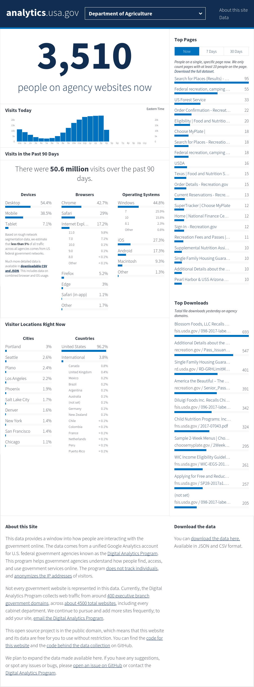
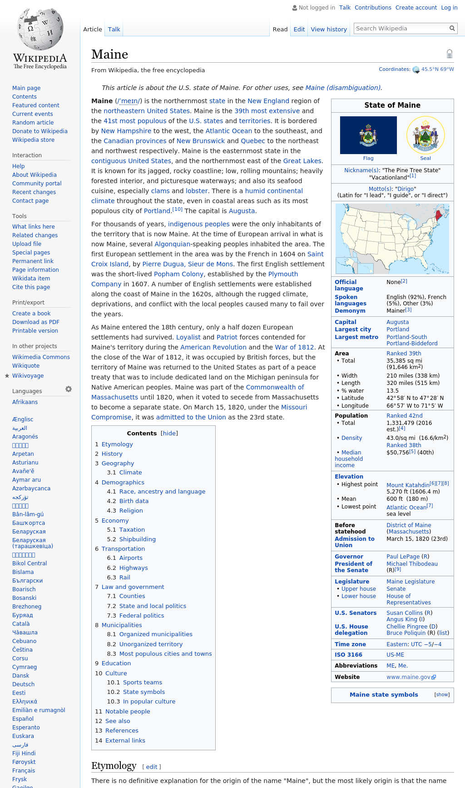

The introductory vignette provided a glimpse into the high-level `render_` functions of `splashr`. Those map directly to the high-level HTTP API calls in the Splash API. Underneath the simplified API lies a powerful [Lua](https://www.lua.org/) scripting interface that can control and query the HTML DOM and return objects of various complexity.

A different vignette will cover the Lua interface, but it's bad enough we all need to know a bit of JavaScript (JS) and CSS and HTML and XML and XPath (etc) to get access to some gnarly web site content. Most of us really don't want to delve into the syntax of yet-another programming language. To make it easier to work at a more detailed level without learning Lua directly, `splashr` provides a pipe-able domain-specific language (DSL) that let you use R functions to covertly build Lua scripts.

## Using the `splashr` DSL

When would you need to have this level of control? Well, say you wanted to scrape a page that requries you to go to a start page first to setup a session. That means you want to hit two URLs in succession, likely after some pause. We can pretent that the <https://analytics.usa.gov/> site has this requirement to illustrate how we'd move from one page to another using the `splashr` DSL (remember, there is an inherent assumption that you've got a Splash instance running on your local system for these vignette code samples):

```
library(splashr)

splash_local %>% 
  splash_response_body(TRUE) %>%
  splash_user_agent(ua_macos_chrome) %>%
  splash_go("https://analytics.usa.gov/") %>% 
  splash_wait(5) %>% 
  splash_go("https://analytics.usa.gov/agriculture/") %>% 
  splash_wait() %>% 
  splash_png() -> agri_png
```

Before showing the page image, let's walk through that chained function call. We:

- started with the built-in object representing a local Splash instance
- told the DSL we want to get content back and not just page resource metadata
- told the Splash browser to impersonate a macOS Chrome browser (that matters for some sites)
- went to our example URL
- paused for a bit
- shifted over to another URL on that site
- paused for a tinier bit
- took a screen shot

Up until `splash_png()` the function chains were just collecting instructions that are eventually transcoded into a Lua script. The call to `splash_png()` triggers this transcoding and sending of the commands over to the Splash instance and waits for content to come back.

Here's the result:

```
agri_png
##   format width height colorspace filesize
## 1    PNG  1024   2761       sRGB   532615
```



We can even interact a bit with a site using this mid-level DSL. Let's fill in a form field on Wikipedia and see the result.

```
splash_local %>% 
  splash_go("https://en.wikipedia.org/wiki/Main_Page") %>% 
  splash_focus("#searchInput") %>% 
  splash_send_text("maine") %>% 
  splash_send_keys("<Return>") %>% 
  splash_wait() %>% 
  splash_png() -> wiki_png

wiki_png
##  format width height colorspace filesize
## 1    PNG  1024  23042       sRGB  8517828
```



(I chopped off that page result as it scrolls for 8MB worth of PNG content and the CRAN folks would not appreciate us taking up that much space for this vignette).

## With Great Power...

...comes time and effort to learn yet-another Shiny New Thing.

However, if you're willing to spend some time to learn some Lua (it's not that bad, really), you can use `splashr` to return actual data from a site vs HTML you have to parse. Let's pull three specific pieces of data from one of the sub-pages of the analytics site we've been scraping:

```
splash_local %>% 
  execute_lua('
function main(splash)
  splash:go("https://analytics.usa.gov/postal-service/")
  splash:wait(5)
  local title = splash:evaljs("document.title")
  local ppl = splash:select("#current_visitors")
  local tot = splash:select("#total_visitors")
  return { 
    title = title, 
    curr_visits = ppl.text(), 
    total_vitis = tot.text()
  }
end
') %>% 
  readBin("character") %>% 
  jsonlite::fromJSON() %>% 
  str()
## List of 3
##  $ total_vitis: chr "581.5 million"
##  $ title      : chr "analytics.usa.gov | The US government's web traffic."
##  $ curr_visits: chr "14,750"
```

We don't have to do any DOM parsing on the R end to get specific bits of data from the page itself. That's pretty handy and once you start making some simple Lua scripts, it gets easier. Note, too, thqat you can use (hopefully) familiar JS constructs to yank info from the DOM as well
as Lua-specific methods.

Don't hesitate to [file an issue](https://github.com/hrbrmstr/splashr/issues) if you'd like more of the lower-level Lua interface brought up to the `splashr` DSL-level.
